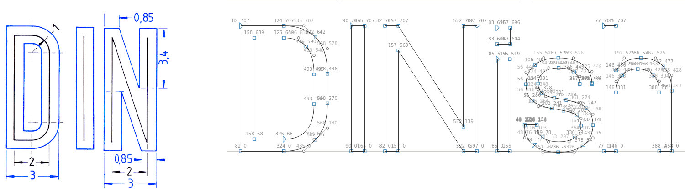

## Introduction

DINish is one of many modern computer fonts that were inspired by the
lettering of the German Autobahn road signs. It is professionally
designed, and usable for body text and captions (and even spreadsheets!)
Its unadorned style is easy to read, and although it's close to a
century old maintains a fresh look.

This DIN font is free to use, for desktop use, e-books, as a web font,
or just to tinker with.

## About the name

The name DINish refers to the fact that the typeface looks like DIN 1451.
Actually, a quick comparison with the standard as can be found in historic
sources shows DINish to not be fully compatible with the standard,
at least not as it was in 1931. That is probably a good thing.

Reading the DIN 1451 standard with modern eyes reveals that it is
more like a lettering standard for technical drawings than a typeface
specification. The standard has no concern for how the brain processes
shapes and whitespace. DINish was drawn with the human reader in
mind, with subtle but loving exceptions to the rigid grid-and-ruler
specification from the _Deutsche Norm_. That said, it retains DIN's
clarity and as such it is a typeface with a purpose, if not a mission.

DINish is available in three widths: standard, Condensed and Expanded. The
standard width roughly matches DIN Mittelschrift, the Condensed width
roughly matches the DIN Engschrift, and Expanded is like DIN
Breitschrift (rarely used in Germany, actually). There are Regular,
Bold and Italic variants; the only combination that is missing is
Condensed Italic.

## Historic roots

DIN 1451 is a [sans-serif](https://en.wikipedia.org/wiki/Sans-serif) typeface
that is widely used for traffic, administrative and technical applications.

It was defined by the German standards body DIN -
[Deutsches Institut für Normung](https://en.wikipedia.org/wiki/Deutsches_Institut_f%C3%BCr_Normung)
(German Institute for Standardization) in the standard sheet DIN 1451-Schriften (typefaces)
in 1931. Similar standards existed for stencilled letters.

Originally designed for industrial uses, the first DIN-type fonts were a
simplified design that could be applied with limited technical difficulty.
Due to the design's legibility and uncomplicated, unadorned design, it has
become popular for general purpose use in signage and display adaptations.
Many adaptations and expansions of the original design have been released
digitally.

See [https://en.wikipedia.org/wiki/DIN_1451](https://en.wikipedia.org/wiki/DIN_1451) for more information.

DINish currently provides the following Unicode coverage:

- Basic Latin: complete
- Latin-1 Supplement: complete
- Plus ISO 8859-15 characters missing in the above.

## OpenType Features

By default, numbers are proportionally spaced. For use in spreadsheets
or other tabular document formats, tabular numbers are available
that line up vertically. In libreOffice, use the Features button in
the Font Style dialog, or type the font name as `Dinish:tnum` in the
font selector. In CSS, use `font-feature-settings: "tnum";`.

## As a webfont

As DINish is not yet available on any of the major free font CDNs, you
will have to host the font yourself. Fortunately, the font is light
in weight: the page you are looking at contains two styles of DINish
in just 30k worth of CSS. Chances are that one JPEG image adds more
weight to your page!
On the [Github page](https://github.com/playbeing/dinish/tree/master/tools),
you'll find a quick Python script to convert a woff2 file into
embeddable CSS. Quick tip, not just for this font: use a tool like
the venerable [yuicompressor](http://yui.github.io/yuicompressor/) to
merge and compress your CSS and JS assets; less hits
on the webserver automatically translates into free performance for
your site visitor!

## Information for Contributors

This Font Software is licensed under the [SIL Open Font License, Version 1.1](https://raw.githubusercontent.com/playbeing/dinish/master/OFL.txt).

In the spirit of Open Source, we're taking patches. Please open an issue on [Github](https://github.com/playbeing/dinish/issues).

[Fontmake](https://github.com/googlefonts/fontmake) is used for generating
fonts, as are [SIL's pysilfont](https://github.com/silnrsi/pysilfont),
[Google's fontbakery](https://github.com/googlefonts/fontbakery) and
[gf-tools](https://github.com/googlefonts/gftools). Both
[FontForge](https://github.com/fontforge/fontforge) and
[TruFont](https://github.com/trufont/trufont) have proven invaluable
for editing.

Copyright © 2021 Bert Driehuis (https://github.com/playbeing/dinish)\
Copyright © 2019 Altinn (https://github.com/Altinn/altinn-din)\
Copyright © 2017 Datto Inc. (https://www.datto.com/fonts/d-din)

Also see [FONTLOG.txt](https://raw.githubusercontent.com/playbeing/dinish/master/FONTLOG.txt).

## Acknowledgements

The [DINish](https://github.com/playbeing/dinish) font is derived from
[Altinn-DIN](https://github.com/Altinn/altinn-din), which in turn is
based on Datto's [D-DIN](https://web.archive.org/web/20210204024059/https://www.datto.com/fonts/d-din/). Datto
commissioned Monotype to create D-DIN and open source it.
Monotype's Creative Type Director
[Charles Nix](https://www.monotype.com/studio/charles-nix)
did the original design.
Many glyphs have been touched since then, and it follows that any errors are the responsibility of the contributors who followed in his footsteps.
The font is made available under the [SIL Open Font License v1.1](https://raw.githubusercontent.com/playbeing/dinish/master/OFL.txt).

## ChangeLog

- 2021-06-06 - v2.005: Add missing glyphs for Turkish language, add lower case alpha.
- 2021-05-25 - v2.004: Add tabular numbers (OpenType tnum feature), minor cleanups
- 2021-04-24 - v2.003: Split into three families, minor cleanups
- 2021-04-13 - v2.002: Renamed to DINish, cleaned up for submission to Google Fonts
- 2021-04-03 - v2.001: Converted to ufo, see NOTES.md
- 2019-11-20 - v2.0: Renamed D-DIN to Altinn-DIN to be able to do minor modifications
- 2017-10-26 - v1.0: First public release
